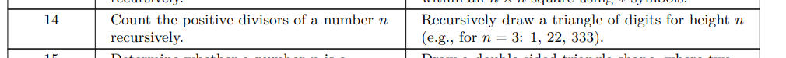

# Lab 11 —  Recursion

**Course:** Programming, Part 1  
**Institution:** NTU KhPI, Kharkiv, Ukraine  
**Student:** Korotkiy Ivan  
**Date:** 01.12
 
---
 
## Task Description
 
>   To learn how to work with text and binary files in the C programming language
 
## Structure
 
```
lab11/
├── attachments/
├── include/
├── src/
├── main.c
├── Makefile
└── Report.md
```
 
## Report

Given task:


---
### Runtime output

Output(Both recursive and itarative variants work same way)
```
Enter a number: 9
Divisor count: 3

Triangle:
1
22
333
4444
55555
666666
7777777
88888888
999999999
```
```
Enter a number: 7 
Divisor count: 2

Triangle:
1
22
333
4444
55555
666666
7777777
```
```
Enter a number: 27
Divisor count: 4

Triangle:
1
22
333
4444
55555
666666
7777777
88888888
999999999
10101010101010101010
1111111111111111111111
121212121212121212121212
13131313131313131313131313
1414141414141414141414141414
151515151515151515151515151515
16161616161616161616161616161616
1717171717171717171717171717171717
181818181818181818181818181818181818
19191919191919191919191919191919191919
2020202020202020202020202020202020202020
212121212121212121212121212121212121212121
22222222222222222222222222222222222222222222
2323232323232323232323232323232323232323232323
242424242424242424242424242424242424242424242424
25252525252525252525252525252525252525252525252525
2626262626262626262626262626262626262626262626262626
272727272727272727272727272727272727272727272727272727
```
### Time taken:
**Recursive**
```
real    0m0.689s
user    0m0.001s
sys     0m0.010s
```
```
real    0m35.518s
user    0m2.809s
sys     0m2.402s
```
**Itarative**
```
real    0m10.040s
user    0m3.823s
sys     0m0.001s
```
```
real    0m33.732s
user    0m2.718s
sys     0m2.532s
```
---