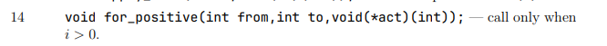

# Lab 06_03 — User Functions (C)
 
---
**Course:** Programming, Part 1  
**Institution:** NTU KhPI, Kharkiv, Ukraine  
**Student:** Korotkiy Ivan  
**Date:** 20.11
 
---
 
## Task Description
 
> Learn to write small, single-purpose function-like macros in C. Variant 14.
 
## Structure
 
```
lab6_3/
├── attachments/
├── build/
├── include/
├── src/
├── main.c
├── Makefile
└── Report.md
```
 
## Report

Func prototype:



---
### Runtime Output

```
-1 10
Square roots: 1.00 1.41 1.73 2.00 2.24 2.45 2.65 2.83 3.00 3.16 
Squares: 1 4 9 16 25 36 49 64 81 100 
Factorials: 1 2 6 24 120 720 5040 40320 362880 3628800
```
```
-3 5
Square roots: 1.00 1.41 1.73 2.00 2.24 
Squares: 1 4 9 16 25 
Factorials: 1 2 6 24 120
```
```
-10 0
Square roots: 
Squares: 
Factorials:
```
```
10 20
Square roots: 3.16 3.32 3.46 3.61 3.74 3.87 4.00 4.12 4.24 4.36 4.47 
Squares: 100 121 144 169 196 225 256 289 324 361 400 
Factorials: 3628800 39916800 479001600 1932053504 1278945280 2004310016 2004189184 -288522240 -898433024 109641728 -2102132736
```
---
### Debus session

```
Breakpoint 1, main () at main.c:7
7       {
(gdb) next
11          if (scanf("%d %d", &from, &to) != 2)
(gdb) next
-3 10
17          printf("Square roots: ");
(gdb) next
18          for_positive(from, to, print_sqrt);
(gdb) next
19          printf("\nSquares: ");
(gdb) print from
$1 = -3
(gdb) print to
$2 = 10
(gdb) print print_sqrt
$3 = {void (int)} 0x55555555523b <print_sqrt>
(gdb) print for_positive
$4 = {void (int, int, ActionInt)} 0x5555555551e9 <for_positive>
(gdb) next
Square roots: 1.00 1.41 1.73 2.00 2.24 2.45 2.65 2.83 3.00 3.16 
20          for_positive(from, to, print_square);
(gdb) next
21          printf("\nFactorials: ");
(gdb) next
Squares: 1 4 9 16 25 36 49 64 81 100 
22          for_positive(from, to, print_fact);
(gdb) next
24          return EXIT_SUCCESS;
(gdb) printf print_square
Bad format string, missing '"'.
(gdb) print print_square
$5 = {void (int)} 0x555555555283 <print_square>
(gdb) print print_fact
$6 = {void (int)} 0x5555555552b1 <print_fact>
(gdb) exit
```
 
---