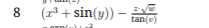
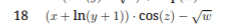
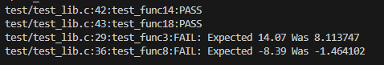

# Lab 7 —  Implementing a Function Library with Unit Testing

**Course:** Programming, Part 1  
**Institution:** NTU KhPI, Kharkiv, Ukraine  
**Student:** Korotkiy Ivan  
**Date:** 29.11
 
---
 
## Task Description
 
> Learn to write small, single-purpose function-like macros in C. Variant 14.
 
## Structure
 
```
lab7/
├── attachments/
├── test/
├── include/
├── src/
├── main.c
├── Makefile
└── Report.md
```
 
## Report

Given formulas:







---
### Coverage screenshot


 
---

### Runtime output
```
42.2 15.8 37.3 93.5 67.7
func14: -6912.32
func18: 31.81
func3: -14061495487242852352.00
func8: 75208.00
```
```
28.3 48.9 0.1 99.3 37.1
func14: -22189.13
func18: 22.08
func3: -558573301175.64
func8: 22665.67
```
```
29.4 78.5 59.1 0.8 5.8
func14: 1004.56
func18: -28.96
func3: 2014715906397411.25
func8: 25512.97
```

---