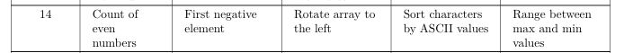

# Lab 7 —  Implementing a Function Library with Unit Testing

**Course:** Programming, Part 1  
**Institution:** NTU KhPI, Kharkiv, Ukraine  
**Student:** Korotkiy Ivan  
**Date:** 29.11
 
---
 
## Task Description
 
> Learn to write small, single-purpose function-like macros in C. Variant 14.
 
## Structure
 
```
lab7/
├── attachments/
├── test/
├── include/
├── src/
├── main.c
├── Makefile
└── Report.md
```
 
## Report

Given task list:


---
### Runtime output

```
3 14 -7 22 0 9 -12 5 8 17

Even nums amount: 5
First nagative number: -7
Rotated array: 17 8 5 -12 9 0 22 -7 14 3 
Range between min and max nums: 34
aF9kLm2QzP

Sorted array by ascii:29FLPQakmz
```
```
4 11 26 15 7 0 18 33 2 10

Even nums amount: 6
No negative values
Rotated array: 10 2 33 18 0 7 15 26 11 4 
Range between min and max nums: 33
dK3!upAqZ9l*mQeRtS1@cVxWb#NfGjHz4P

Sorted array by ascii:!#*1349@AGHKNPQRSVWZbcdefjlmpqtuxz
```
```
19 -3 8 0 -11 27 6 5 -9 14

Even nums amount: 4
First nagative number: -3
Rotated array: 14 -9 5 6 27 -11 0 8 -3 19 
Range between min and max nums: 38
QwErTy123!@#AsDfGhJkL0$%^ZoXmCnBvUiOpPlMnNbVgTrEdSzXc

Sorted array by ascii:!#$%0123@ABCDEEGJLMNOPQSTTUVXXZ^bcdfghiklmnnoprrsvwyz
```
```
25 7 -6 13 0 -17 29 4 8 -1

Even nums amount: 4
First nagative number: -6
Rotated array: -1 8 4 29 -17 0 13 -6 7 25 
Range between min and max nums: 46
aB3!kLp9@zXq7#nMvTg5$hJr2%fDw8&yUe1^cIo0*VsQb4)ZtYx6(WRmNjFuPaHsKdGlOjIuYtReWqPlOkMnBtVcXsZaQwErTyUiOpAsDfGhJkLzXc

Sorted array by ascii:!#$%&()*0123456789@ABBDDEFGGHIIJJKLLMMNOOOPPQQRRTTUUVVWWXXXYYZZ^aaabcccdeeffghhijjkkkllmnnoppqqrrsssstttuuvwwxyyzz
```
 
---