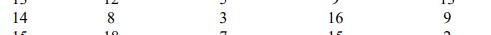
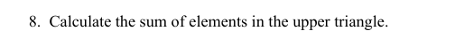
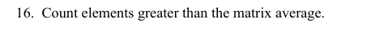
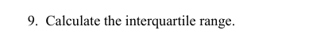
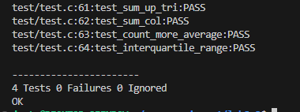

# Lab 8 —  Implementing a Function Library with Unit Testing

**Course:** Programming, Part 1  
**Institution:** NTU KhPI, Kharkiv, Ukraine  
**Student:** Korotkiy Ivan  
**Date:** 29.11
 
---
 
## Task Description
 
>  The objective of this lab is to process 2D arrays in C, focusing on index based operations,matrix manipulation, aggregate functions and 1D representation of matrices. Variant 14.
 
## Structure
 
```
lab8_2/
├── attachments/
├── test/
├── include/
├── src/
├── main.c
├── Makefile
└── Report.md
```
 
## Report

Given task list:








---
### Unity tests screenshot


 
---