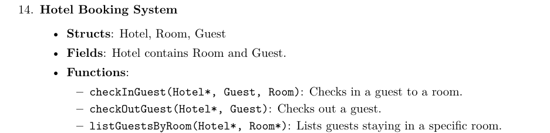

# Lab 9 —  Structs in C

**Course:** Programming, Part 1  
**Institution:** NTU KhPI, Kharkiv, Ukraine  
**Student:** Korotkiy Ivan  
**Date:** 30.11
 
---
 
## Task Description
 
>   The objective of this lab assignment is to familiarize students with structs in C programming.
 
## Structure
 
```
lab9/
├── attachments/
├── include/
├── src/
├── main.c
├── Makefile
└── Report.md
```
 
## Report

Given task:


---
### Runtime output

```
Maxim was checked in in room number 1
Artem was checked in in room number 2
Oleg was checked in in room number 3
A1 was checked in in room number 4
This room is not free!
A3 was checked in in room number 5
A4 was checked in in room number 6
A5 was checked in in room number 7
A6 was checked in in room number 8
A7 was checked in in room number 9
This room is not free!
Bad1 was checked in in room number 10
Bad2 was checked in in room number 11
<--->
Room 1: Maxim
Room 2: Artem
Room 3: Oleg
Room 4: A1
Room 5: A3
Room 6: A4
Room 7: A5
Room 8: A6
Room 9: A7
Room 10: Bad1
Room 11: Bad2
<--->
Checked out Maxim from room number 1
Checked out A3 from room number 4
Checked out A5 from room number 5
<--->
Room 1: Empty
Room 2: Artem
Room 3: Oleg
Room 4: Empty
Room 5: Empty
Room 6: A4
Room 7: A5
Room 8: A6
Room 9: A7
Room 10: Bad1
Room 11: Bad2
```
 
---